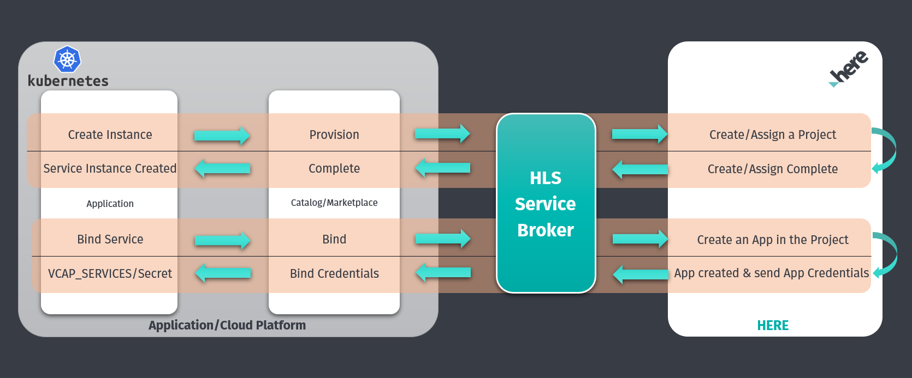

# Getting Started on Kubernetes

High-level architecture diagram for the Service Broker on Kubernetes.


## Prerequisites

### HERE Developer Portal Steps
To start using this Service Broker you will need to register on [HERE Developer Portal](https://developer.here.com/sign-up?utm_medium=referral&utm_source=GitHub-Service-Broker&create=Freemium-Basic&keepState=true&step=terms) and acquire OAuth 2.0 credentials by following these steps:
* Sign Up for a HERE Account on the [HERE Developer Portal](https://developer.here.com/sign-up?utm_medium=referral&utm_source=GitHub-Service-Broker&create=Freemium-Basic&keepState=true&step=terms)

* Go to the REST Section and generate an App.
* Once the APP is generated, create an OAuth 2.0 (JSON Web Tokens) credentials under that and download the credentials file.


### Kubernetes Installation Prerequisites
* [Install](https://docs.Helm.sh/using_helm/#install-Helm) Helm and Tiller.
* [Install](https://docs.docker.com/install/) docker. Docker needs to be installed in the machine to build a docker image of the project. 
* A docker registry (public or private) to push the broker image is required.
* [Install](https://maven.apache.org/install.html) maven. Maven should be installed to build the broker project.


## Setup and Installation

### Installing Kubernetes Service Catalog

Kubernetes Service Catalog client is an extension API that enables applications running in Kubernetes clusters to easily use external managed software offerings, such as a datastore service offered by a cloud provider.

Add the Kubernetes Service Catalog Helm repository:

```bash
helm repo add svc-cat https://svc-catalog-charts.storage.googleapis.com
```

Install the Kubernetes Service Catalog Helm chart:

```bash
helm install svc-cat/catalog --timeout 300 --name catalog
```

### Checkout and build the GitHub roject
```bash
### Clone the Git repository
git clone https://gitHub.com/heremaps/here-hls-service-broker.git

### Navigate to hls-service-broker directory.
cd here-hls-service-broker

### Build the project
mvn clean package
```

### Build and push Docker image
```bash
### Build a Docker image
docker build -t hls-service-broker .

### Tag the image just created. Replace image-id, docker-repository and tag with correct values
docker tag <image-id> <docker-repository>/hls-service-broker:<tag>

### Push the Docker image to the registry. Replace docker-repository and tag with correct values
docker push <docker-repository>/hls-service-broker:<tag>

### Check if the broker service is up and running
curl <broker-url>/actuator/health

```

### Update the values.yaml
Edit values.yaml and update the following parameters. Leave all other parameters as is.
1. Update hereTokenEndpointUrl, hereClientId, hereAccessKeyId & hereAccessKeySecret env properties from the credentials file downloaded from the prerequisites step.
2. Docker image repository. Change image.repository property.
3. Highly recommend to change default brokerBasicAuthUsername and brokerBasicAuthPassword env properties. These credentials are required to register the broker with the Kubernetes Service Catalog.

### Install broker using Helm chart

```bash
### Navigate to the Kubernetes deployment directory
cd deploy/kubernetes

### Install the broker Helm in your namespace
helm install . --name hls-service-broker --namespace <namespace>
 
### Check the installation status by executing below command.
helm list 
 
### As a part of the installation, ClusterServiceBroker will install automatically and fetch the catalog. 
### To check the status execute below command.
kubectl get ClusterServiceBroker
```
Example Response
```text
NAME                  URL                                                                           STATUS   AGE
hls-service-broker   http://hls-service-broker-hls-service-broker.development.svc.cluster.local   Ready    20h
```

### Find Catalog 
```bash
### To get the Catalog details execute below command.
kubectl get ClusterServicePlan  
```
Exmple Response
```text
NAME     EXTERNAL-NAME   BROKER                CLASS                                  AGE
136534   Freemium-XYZ    hls-service-broker   7809de91-28a6-43a1-8568-7dfc3a95c406   19h
```
 
## Provisioning - Create instance
Below is one example Kubernetes resource yaml to provision HLS services.
```bash
cat ./example/hls-service-instance.yaml

### Creating a new HLS Service Instance
kubectl apply -f ./example/hls-service-instance.yaml 
 
### Above command will create a Service Instance object. To check please execute below command.
kubectl get ServiceInstance -n <namespace>
```
Example Response
```text
NAME                          CLASS                                    PLAN           STATUS   AGE
devrel-dev-service-instance   ClusterServiceClass/hls-service-broker   Freemium-XYZ   Ready    47h
```

## Binding - Create credential
Below is one example Kubernetes resource yaml to create binding.

```bash  
cat ./example/hls-service-binding.yaml

### Creating a new HLS Service Binding
kubectl apply -f ./example/hls-service-binding.yaml 
 
### To check the binding status please run below command   
kubectl get ServiceBinding -n <namespace>
```

Sample Response
```text
NAME                    SERVICE-INSTANCE              SECRET-NAME             STATUS   AGE
here-service-binding    devrel-dev-service-instance   here-service-binding    Ready    2d
```

#### View Binding Secret
When the binding request completes successfully the user should see a secret created in the Kuberenetes Cluster with all the credentials/configurations.
The name of the secret will be the same as the ServiceBinding name. 

Command:
```bash 
kubectl get secrets <binding-name> -o yaml -n <namespace>
```

Example:
```bash
kubectl get secrets here-service-binding -o yaml -n marketplace
``` 
 
Output:
```yaml
apiVersion: v1
data:
app_code: LTgxWkp4T2wwa1VNM2ktNjFkN01Xdw== (Base 64 Encoded)
app_id: TjR1ZEdpVERtRnozNU95bnlScFM= (Base 64 Encoded)
kind: Secret
metadata:
creationTimestamp: "2019-07-30T06:56:43Z"
name: here-service-binding
namespace: marketplace
ownerReferences:
- apiVersion: servicecatalog.k8s.io/v1beta1
 blockOwnerDeletion: true
 controller: true
 kind: ServiceBinding
 name: here-service-binding
 uid: 1b3d1ff4-b297-11e9-9b7b-0242ac110007
resourceVersion: "150528"
selfLink: /api/v1/namespaces/marketplace/secrets/here-service-binding
uid: dcc67560-ad8a-4fc0-9a01-802cc2bfbf47
type: Opaque
```  
 
## Un-binding - Delete credentials
Deleting the Service binding created in the previous step will result in the secret (having credentials) getting deleted.

Command:
```bash
kubectl delete ServiceBinding <binding-name> -n <namespace>
```

Example:
```bash
kubectl delete ServiceBinding  here-service-binding -n marketplace
```

## Un-provisioning - Delete instance
When the HLS Service instance is no longer required, it can be deleted as follows.
All Service Bindings for a ServiceInstance should be deleted before deleting the ServiceInstance.

Command:
```bash
kubectl delete ServiceInstance <instance-name -n <namespace>
```
Example:
```bash
kubectl delete ServiceInstance  here-service-instance -n marketplace
```