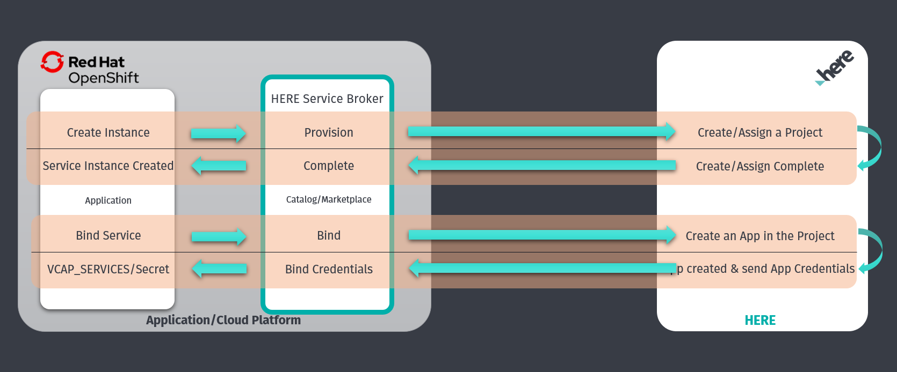

# Getting Started on OpenShift

High-level architecture diagram for the Service Broker on Red Hat OpenShift.


## Prerequisites

### HERE Developer Portal Steps
To start using this Service Broker you will need to register on [HERE Developer Portal](https://developer.here.com/sign-up?utm_medium=referral&utm_source=GitHub-ServiceBroker&create=Freemium-Basic&keepState=true&step=terms) and acquire app credentials by following these steps:
* Sign Up for a HERE Account on the [HERE Developer Portal](https://developer.here.com/sign-up?utm_medium=referral&utm_source=GitHub-Service-Broker&create=Freemium-Basic&keepState=true&step=terms)
* After signing-up and obtaining your HERE Account, create a new Project.
* On the project details, in the REST & XYZ HUB API/CLI section, generate App ID and App Code.
* Copy the App ID and App Code. 


### Red Hat OpenShift Installation Prerequisites
* [Install](https://docs.docker.com/install/) Docker. Docker needs to be installed in the machine to build a docker image of the project. 
* A Docker registry (public or private) to push the broker image is required.
* [Install](https://maven.apache.org/install.html) maven. Maven should be installed to build the broker project.
* [Install](https://docs.openshift.com/enterprise/3.1/cli_reference/get_started_cli.html#installing-the-cli) the OpenShift command line client (oc).

## Installation

### Checkout and build the GitHub project
```bash
### Clone the git repository
git clone https://github.com/heremaps/here-hls-service-broker.git

### Navigate to hls-service-broker directory.
cd here-hls-service-broker

### Build the project
mvn clean package
```

### Build and Push Docker Image
```bash
### Build a docker image
docker build -t hls-service-broker .

### Tag the image just created. Replace image-id, docker-repository and tag with correct values
docker tag <image-id> <docker-repository>/hls-service-broker:<tag>

### Push the docker image to the registry. Replace docker-repository and tag with correct values
docker push <docker-repository>/hls-service-broker:<tag>
```

### Deploy and register the broker

```bash
### Navigate to the OpenShift deployment directory
cd deploy/openshift

### Edit parameters.env and update the following parameters. Leave all other parameters as is.
# 1. HERE App Id/App Code acquired from prerequisites step.
# 2. Docker Image name
# 3. If required change BASIC_AUTH_USERNAME and BASIC_AUTH_PASSWORD
# 3. Highly recommend to change default BASIC_AUTH_USERNAME and BASIC_AUTH_PASSWORD properties. These credentials are required to register the broker with the OpenShift container catalog.
vi parameters.env

### Change deployment.sh execute permission
chmod +x deployment.sh

### Execute the deployment script
### By default the below script creates a project named hls-sb. If this needs to be changed, modify the deployment.sh file
./deployment.sh

### check that the broker is running:
oc get pods | grep hls-service-broker

### check service broker logs
oc logs $(oc get pods --no-headers -o name | grep hls-service-broker)

### Check if the broker service is up and running
curl <broker-url>/actuator/health

```

## Provisioning - Service Instance Creation
Once the deployment and registration steps are executed, the OpenShift Cluster Service Catalog will show the "HERE Location Services" as a catalog listing.
To create a Service Instance for HERE Location Services, select the "HERE Location Services" listing and follow the instructions.

## Binding - Create credentials
Binding creation option is provided during the instance creation step which can be used to create the binding along with the instance creation.
Alternately, binding can be created separately from the OpenShift Web UI as follows:

* Navigate to the project in which the instance has been created.
* Navigate to the "Applications" menu and select "Provisioned Services".
* Click on the "Create Binding" option and follow the instructions to create the binding.
* Provide an optional binding name in the configuration step. This binding name will be used to name the app created at HERE end for the binding. 
* Once binding is done a Secret will be created which can be used to invoke the HLS APIs.

## Un-binding - Delete credentials
When the binding is no longer needed, it can be deleted from the same place it was created at.

## Un-provisioning - Delete instance
When the HLS Service instance is no longer required, it can be deleted from the "Provisioned Services" under "Applications" menu.

##
